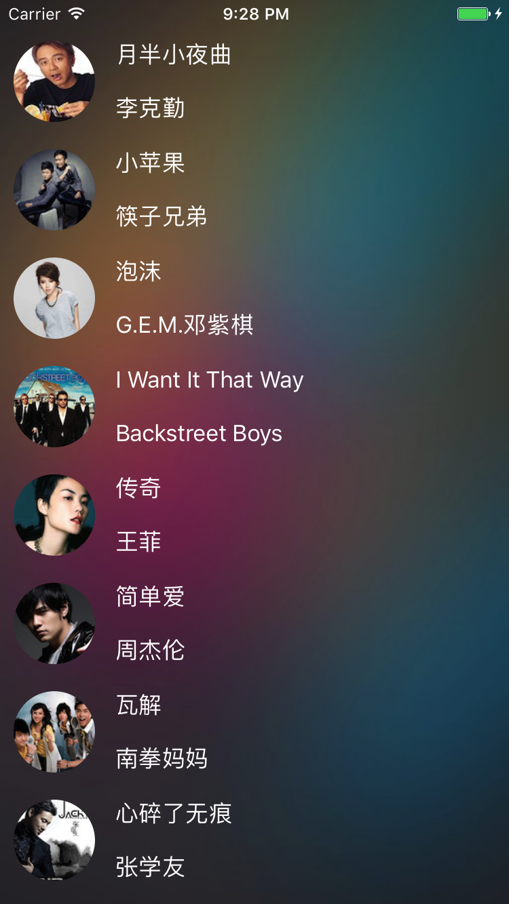
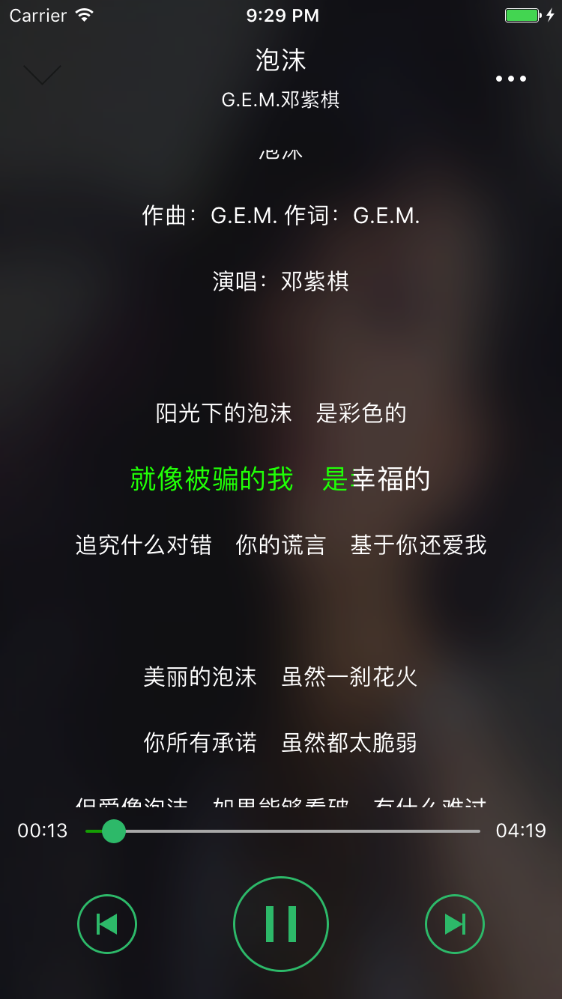

# MusicPlayer
一款适合初学者学习的音乐播放器，UI来源于QQ音乐，已经实现了播放列表、播放界面、歌词滚动效果、锁屏歌词展示效果等功能。基本上每句代码都已经写上注释了，另外附有项目结构说明[MusicPlayer.xmind](MusicPlayer.xmind),参考学习，可以直接跳转到对应的代码！

---

# Screenshot
## 播放列表

## 播放界面

## 歌词界面

## GIF效果图
